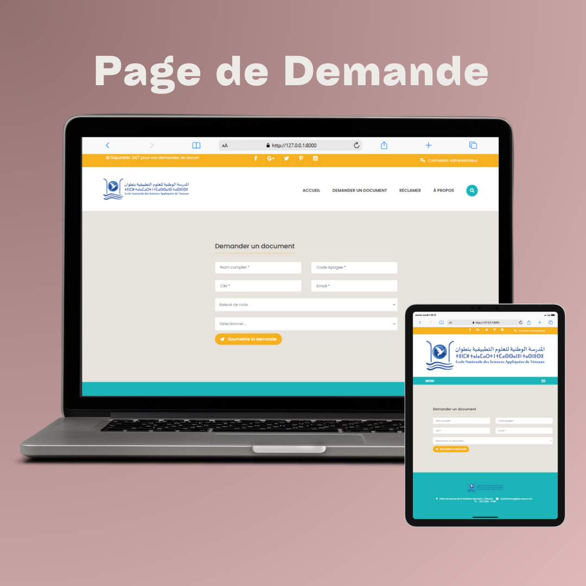
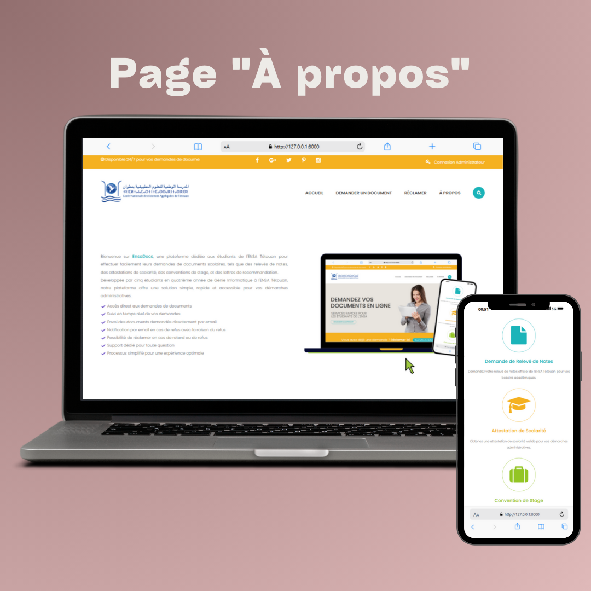
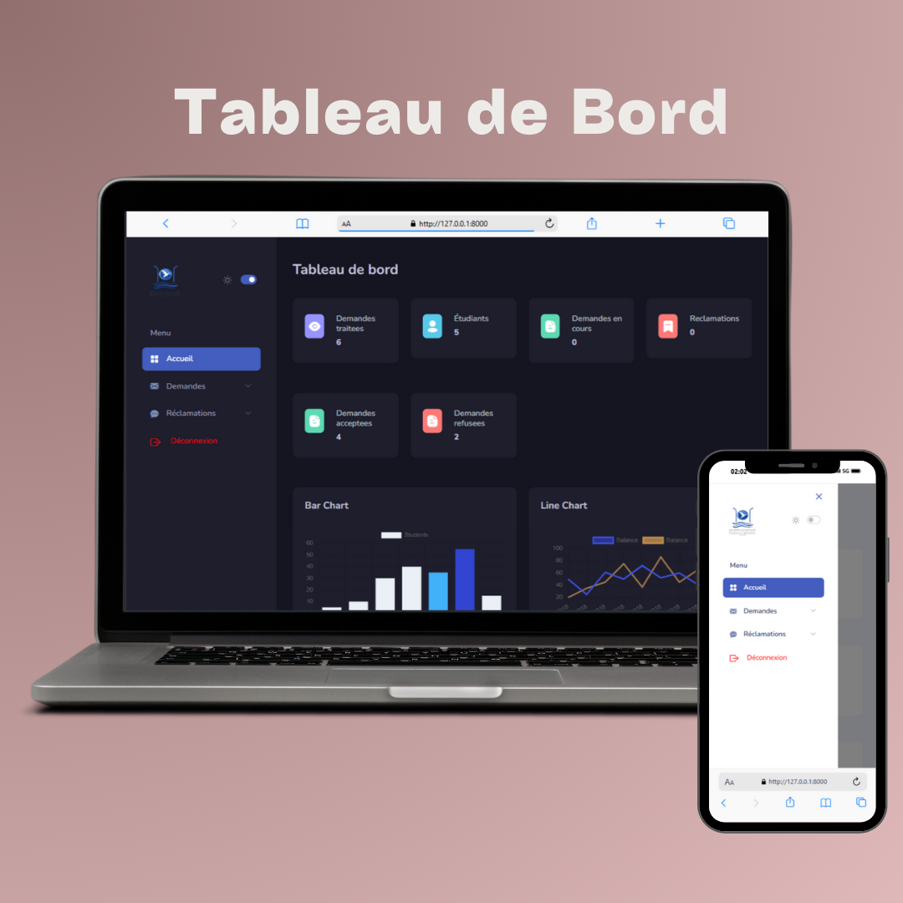

# EnsaDocs - Plateforme pour Demandes de Documents Scolaires 📝

    
    
    
    
     
    

Bienvenue sur **EnsaDocs**, une plateforme conçue pour simplifier les démarches administratives des étudiants de l'ENSA Tétouan.  
Grâce à cette plateforme, les étudiants peuvent demander facilement et rapidement différents documents scolaires, tels que :  

- **Relevés de notes** 📋  
- **Attestations de scolarité** 🏫  
- **Conventions de stage** 📄  
- **Lettres de recommandation** 📨  

Notre plateforme propose une gestion complète des demandes avec suivi en temps réel et notifications par email.

---

## Fonctionnalités

- **Accès direct aux demandes de documents**
- **Suivi en temps réel de vos demandes**
- **Envoi des documents demandés directement par email**
- **Notification par email en cas de refus avec la raison du refus**
- **Possibilité de réclamer en cas de retard ou de refus**
- **Support dédié pour toute question**
- **Processus simplifié pour une expérience optimale**

---

## Technologies Utilisées

- **Laravel** 🌐  
- **Bootstrap** 🎨  
- **MySQL** 🛢️  

---
